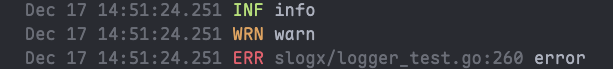

# slogx

Lightweight `log/slog` helper that:

- routes **Info/Debug/Warn** to a compact handler (no source info)
- routes **Error+** to a handler with source locations
- highlights error attributes using [`tint`](https://github.com/lmittmann/tint)
- optionally sets the logger as the global default, so other packages can just use `slog.*`



## Install

```bash
go get github.com/vietddude/slogx
```

## Usage

### Basic Usage

```go
package main

import (
	"errors"

	"github.com/vietddude/slogx"
)

func main() {
	// Create and register the default logger using built-in options.
	log := slogx.InitDefault()

	log.Debug("Debug message", "detail", "something")
	log.Info("User login", "user", "alice", "ip", "127.0.0.1")
	log.Warn("High memory usage", "usage", "85%")

	err := errors.New("connection refused")
	log.Error("Failed to load", "err", err)
}
```

Any other package can now just use the global `slog`:

```go
import (
	"errors"
	"log/slog"
)

func doSomething() {
	testErr := errors.New("test error")
	slog.Error("test error", "error", testErr)
}
```

### Customizing Log Level

You can set the minimum log level by passing `tint.Options`:

```go
package main

import (
	"log/slog"

	"github.com/lmittmann/tint"
	"github.com/vietddude/slogx"
)

func main() {
	// Only log Warn and above
	log := slogx.InitDefault(&tint.Options{
		Level: slog.LevelWarn,
	})

	log.Debug("This won't appear")
	log.Info("This won't appear either")
	log.Warn("This will appear", "key", "value")
	log.Error("This will appear with source", "err", "something")
}
```

### Customizing `tint.Options`

You can pass your own [`tint.Options`](https://pkg.go.dev/github.com/lmittmann/tint#Options) to `New` or `InitDefault`.  
`slogx` will:

- always disable `AddSource` for low-level logs (Info/Debug/Warn)
- always enable `AddSource` for error logs
- wrap your `ReplaceAttr` so that `"err"` / `"error"` attributes stay highlighted in red

```go
package main

import (
	"log/slog"
	"time"

	"github.com/lmittmann/tint"
	"github.com/vietddude/slogx"
)

func main() {
	opts := &tint.Options{
		Level:      slog.LevelDebug,
		TimeFormat: time.RFC3339,
		NoColor:    false,
		ReplaceAttr: func(groups []string, a slog.Attr) slog.Attr {
			// Example: rename "user_id" to "userID" in the output.
			if a.Key == "user_id" {
				a.Key = "userID"
			}
			return a
		},
	}

	logger := slogx.New(opts)
	slog.SetDefault(logger)

	slog.Info("Processing request", "user_id", 123)
	slog.Error("Failed to process request", "user_id", 123, "err", "timeout")
}
```

### Advanced Usage

If you need more control, use `New()` directly:

```go
package main

import (
	"log/slog"

	"github.com/lmittmann/tint"
	"github.com/vietddude/slogx"
)

func main() {
	// Create logger without setting it as default
	logger := slogx.New(&tint.Options{
		Level:   slog.LevelInfo,
		NoColor: true, // Disable colors for production logs
	})

	// Use it directly or set as default later
	logger.Info("Application started")
	
	// Set as default if needed
	slog.SetDefault(logger)
}
```

## Features

- **Level-based routing**: Low-level logs (Debug/Info/Warn) use a compact format, while errors include source file and line information
- **Configurable**: Set minimum log level, time format, colors, and custom attribute transformations
- **Error highlighting**: `err` and `error` attributes are automatically highlighted in red for better visibility
- **Global default**: Easy integration with existing code that uses `slog.*` functions
- **Zero dependencies** (except `tint` and standard library)

## License

MIT